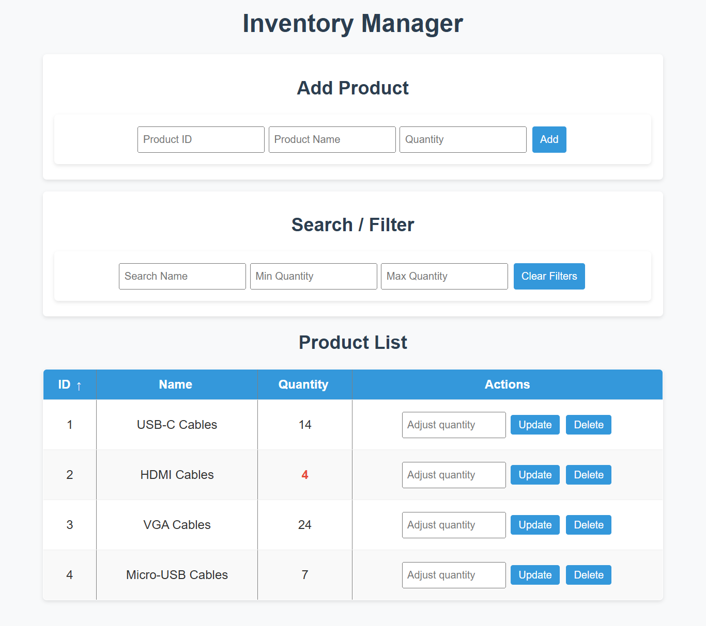

# Product Inventory Management



## Live Demo

👉 [View the app on GitHub Pages](https://c-phillips99.github.io/JavaScript-Inventory-System/) 

## Features

✅ **Add Products**
- Unique product ID required
- Input validation ensures all fields are filled correctly
- Product IDs must be unique

✅ **List Products**
- Displays ID, name, and current quantity
- Quantity flagged in red if low (under 5)

✅ **Update Quantity**
- Adjust quantity by custom amount (positive or negative)
- Prevents quantity from dropping below zero

✅ **Delete Product**
- Delete by ID
- Confirmation prompt protects against accidental deletion

✅ **Search & Filter**
- Search by partial product name (case-insensitive)
- Filter by minimum and/or maximum quantity
- Clear filters button resets all search/filter fields

✅ **Sorting**
- Clickable table headers sort by ID, Name, or Quantity
- Arrows (↑ ↓) show current sort field and direction
- Toggles between ascending and descending on repeated clicks

✅ **Persistent Storage**
- Inventory data saved to localStorage
- Survives page reloads so you don't lose your data

✅ **User Experience Polishing**
- Inputs auto-clear and focus for faster entry
- Row striping for readability
- Hover highlighting on rows for easy scanning
- Responsive layout for small screens
- Smooth transitions on row hover

---

## How to Run Locally

1. Open `index.html` in your browser
2. Start adding, managing, and filtering products
3. Your data will be saved automatically (localStorage)

---

## Above-and-Beyond Enhancements

💡 **Persistent Data Storage**
- localStorage ensures your inventory stays intact between sessions

💡 **Low Stock Visual Flag**
- Quantity below 5 is highlighted for quick awareness

💡 **Interactive Sorting**
- Table headers toggle sorting with visible direction arrows

💡 **Delete Confirmation**
- Reduces risk of accidental product removal

💡 **Clear Filters**
- One-click reset of search and quantity filters

💡 **Sanitization**
- All user input is sanitized and checked for malicious intent

💡 **Enhanced UI**
- Row striping + hover highlighting for clean presentation
- Focus management for quick data entry

---

## File Structure
```
/ (root)
├── index.html
├── style.css
├── app.js
└── README.md
```

## Notes

- Pure JavaScript, HTML, and CSS — no frameworks
- Designed for clarity, usability, and simplicity
